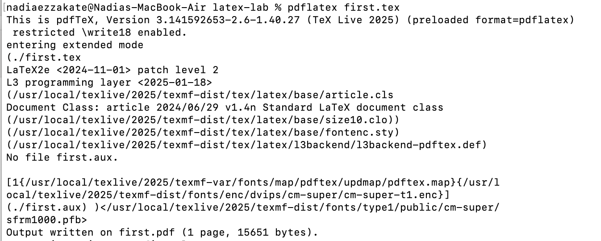
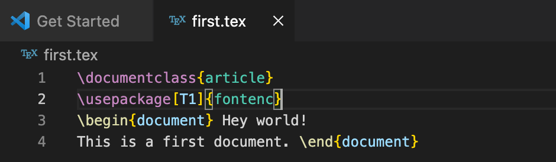
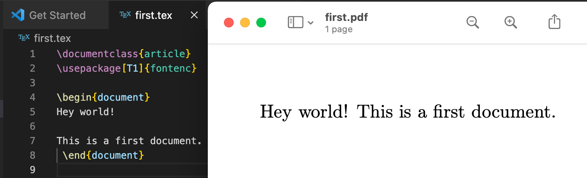
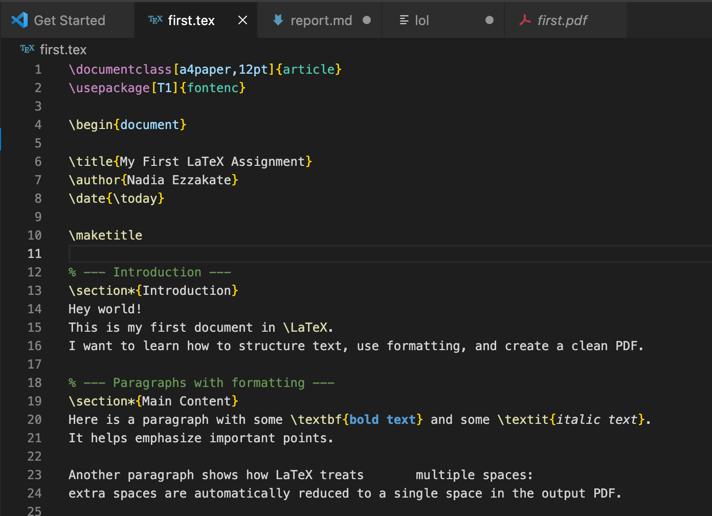
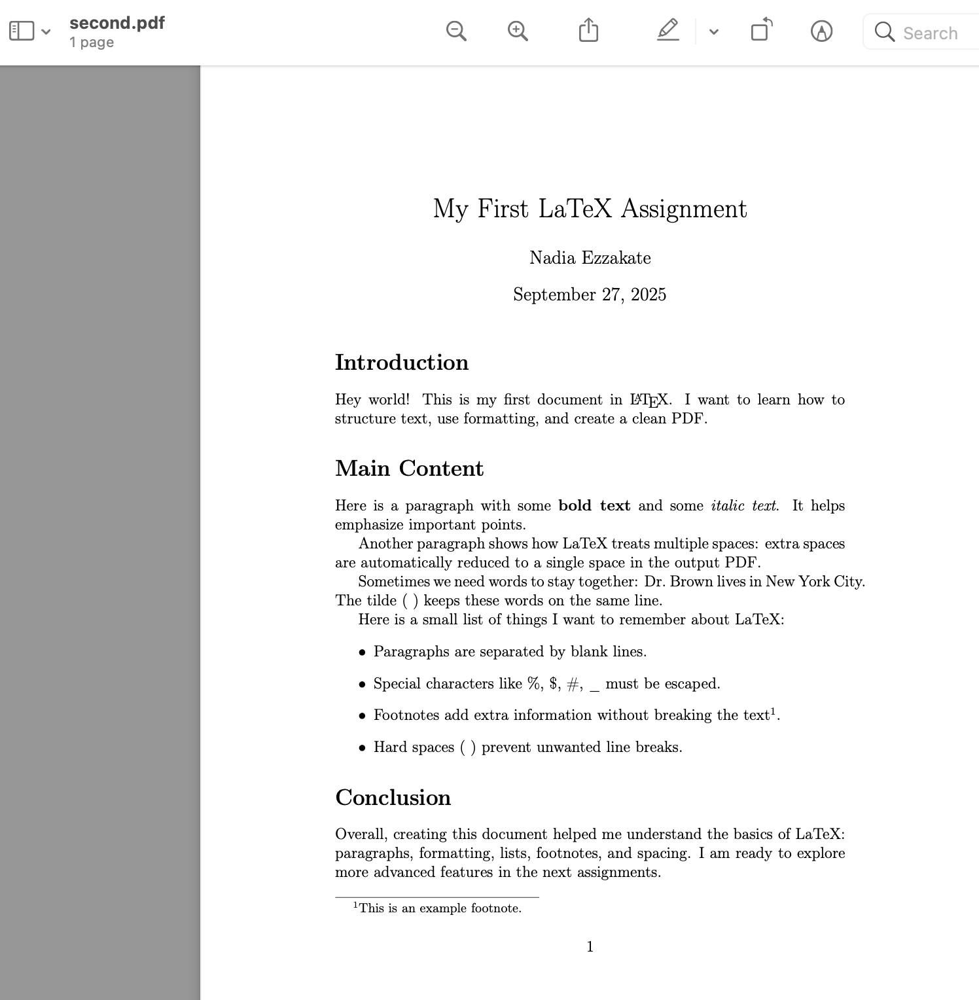
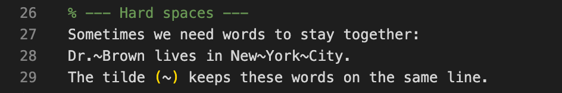
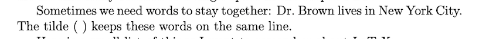

---
## Front matter
title: "Шаблон отчёта по лабораторной работе №2"
subtitle: "Practical scientific writing"
author: "Nadia Ezzakate"

## Generic options
lang: ru-RU
toc-title: "Содержание"

## Bibliography
bibliography: bib/cite.bib
csl: pandoc/csl/gost-r-7-0-5-2008-numeric.csl

## Pdf output format
toc: true
toc-depth: 2
lof: true
lot: true
fontsize: 12pt
linestretch: 1.5
papersize: a4
documentclass: scrreprt

## I18n polyglossia
polyglossia-lang:
  name: russian
  options:
    - spelling=modern
    - babelshorthands=true
polyglossia-otherlangs:
  name: english

## I18n babel
babel-lang: russian
babel-otherlangs: english

## Fonts
mainfont: IBM Plex Serif
romanfont: IBM Plex Serif
sansfont: IBM Plex Sans
monofont: IBM Plex Mono
mathfont: STIX Two Math
mainfontoptions: Ligatures=Common,Ligatures=TeX,Scale=0.94
romanfontoptions: Ligatures=Common,Ligatures=TeX,Scale=0.94
sansfontoptions: Ligatures=Common,Ligatures=TeX,Scale=MatchLowercase,Scale=0.94
monofontoptions: Scale=MatchLowercase,Scale=0.94,FakeStretch=0.9
mathfontoptions:

## Biblatex
biblatex: true
biblio-style: "gost-numeric"
biblatexoptions:
  - parentracker=true
  - backend=biber
  - hyperref=auto
  - language=auto
  - autolang=other*
  - citestyle=gost-numeric

## Pandoc-crossref LaTeX customization
figureTitle: "Рис."
tableTitle: "Таблица"
listingTitle: "Листинг"
lofTitle: "Список иллюстраций"
lotTitle: "Список таблиц"
lolTitle: "Листинги"

## Misc options
indent: true
header-includes:
  - \usepackage{indentfirst}
  - \usepackage{float}
  - \floatplacement{figure}{H}
---

# Цель работы

Целью данной лабораторной работы является ознакомление с работа с структура документа LaTeX.

# Задание

1. Try adding text to your first document, typesetting and seeing the changes in your PDF.  
2. Make some different paragraphs and add variable spaces.  
3. Explore how your editor works; click on your source and find how to go to the same line in your PDF.  
4. Try adding some hard spaces and see how they influence line-breaking.  

# Теоретическое введение

```latex
\documentclass{article}
\usepackage[T1]{fontenc}
\begin{document}
Hey world!
This is a first document.
\end{document}
```
(см. Рис. [-@fig:001]).

{ #fig:001 width=100% }

## Running LaTeX

(см. Рис. [-@fig:002]).

{ #fig:002 width=100% }

(см. Рис. [-@fig:003]).
{ #fig:003 width=100% }

# Выполнение лабораторной работы

##  Try adding text to your first document, typesetting and seeing the changes in your PDF.

 
 (см. Рис. [-@fig:004]).

{ #fig:004 width=100% }
{ #fig:004 width=100% }
```
 \documentclass[a4paper,12pt]{article}
\usepackage[T1]{fontenc}

\begin{document}

\title{My First LaTeX Assignment}
\author{Nadia Ezzakate}
\date{\today}

\maketitle

% --- Introduction ---
\section*{Introduction}
Hey world!  
This is my first document in \LaTeX.  
I want to learn how to structure text, use formatting, and create a clean PDF.

% --- Paragraphs with formatting ---
\section*{Main Content}
Here is a paragraph with some \textbf{bold text} and some \textit{italic text}.  
It helps emphasize important points.

Another paragraph shows how LaTeX treats       multiple spaces:  
extra spaces are automatically reduced to a single space in the output PDF.  

% --- Hard spaces ---
Sometimes we need words to stay together:  
Dr.~Brown lives in New~York~City.  
The tilde (~) keeps these words on the same line.

% --- Lists ---
Here is a small list of things I want to remember about LaTeX:
\begin{itemize}
    \item Paragraphs are separated by blank lines.
    \item Special characters like \%, \$, \#, \_ must be escaped.
    \item Footnotes add extra information without breaking the text\footnote{This is an example footnote.}.
    \item Hard spaces (~) prevent unwanted line breaks.
\end{itemize}

% --- Conclusion ---
\section*{Conclusion}
Overall, creating this document helped me understand the basics of LaTeX: paragraphs, formatting, lists, footnotes, and spacing.  
I am ready to explore more advanced features in the next assignments.

\end{document}


```

## Make some different paragraphs and add variable spaces.

(см. Рис. [-@fig:005]).

{ #fig:005 width=100% }

## Explore how your editor works; click on your source and find how to go to the same line in your PDF.
## Try adding some hard spaces and see how they influence line-breaking.

{ #fig:005 width=100% }

 (см. Рис. [-@fig:006]).

{ #fig:005 width=100% }